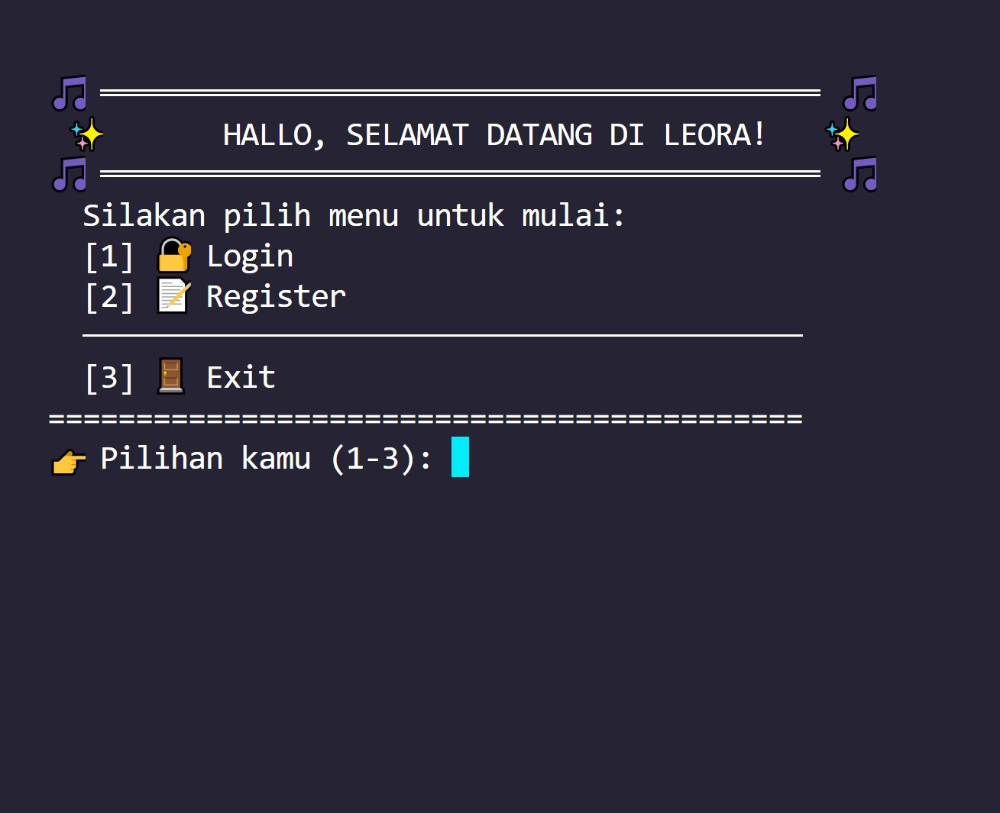
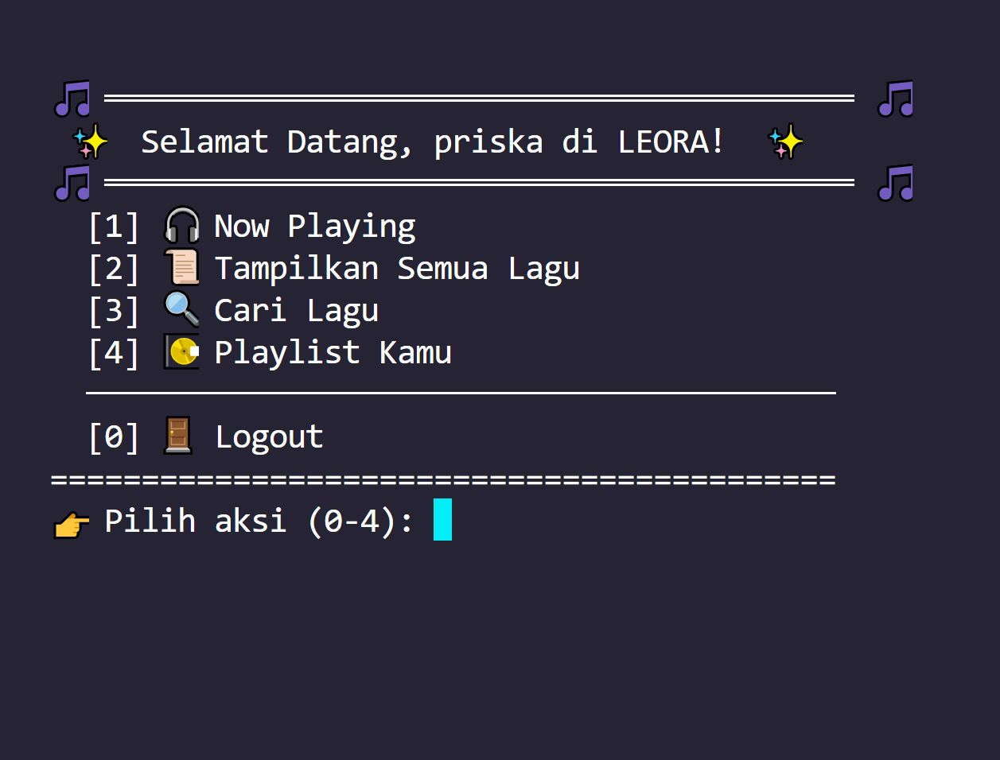
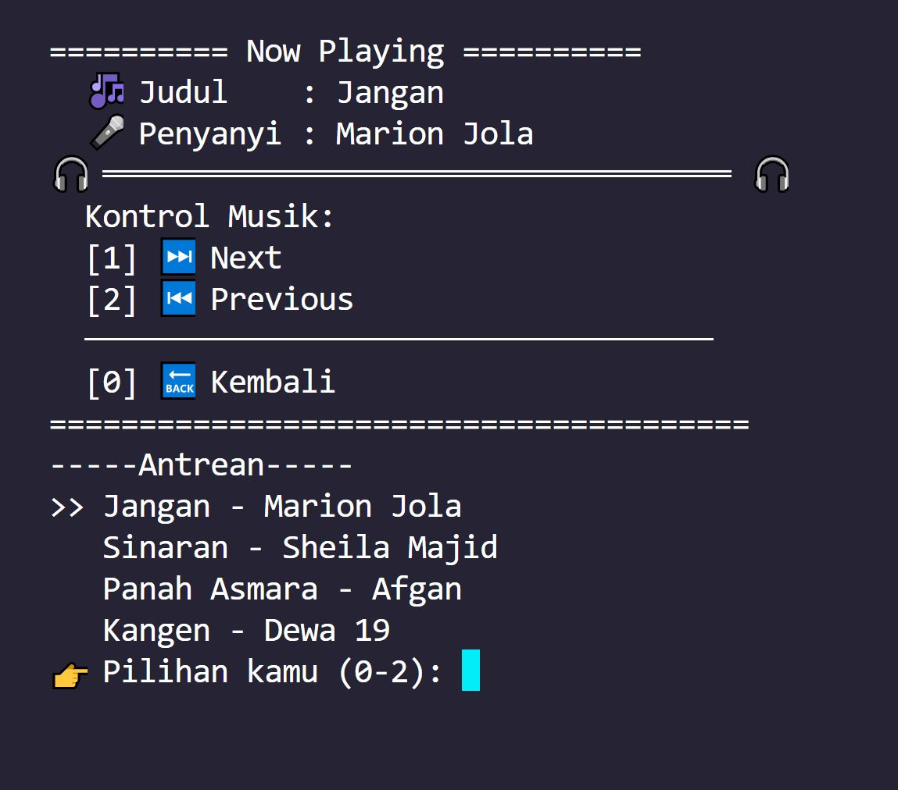
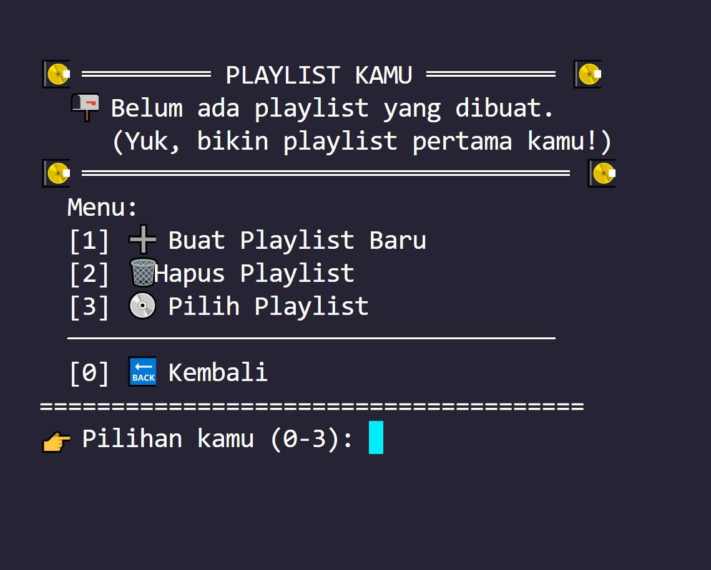

# 🎵 LEORA - CLI Music Player App

> Aplikasi Pemutar Musik Berbasis Command Line Interface (CLI) yang dikembangkan menggunakan C++. Proyek ini dibuat untuk memenuhi Tugas Ujian Tengah Semester (UTS) Mata Kuliah Struktur Data dan Algoritma.


---

## ✨ Fitur Utama 

Aplikasi LEORA memisahkan hak akses antara **Admin** dan **User**, dengan database berbasis file teks (`.txt`).

### 👑 Fitur Admin
* **Manajemen Data Lagu:** Menambahkan lagu baru atau menghapus lagu dari database.
* **Keamanan Akses:** Login khusus menggunakan role admin.

### 🎧 Fitur User
* **Pencarian Lagu:** Mencari lagu berdasarkan judul.
* **Now Playing & Queue System:** Memutar lagu saat ini, memutar lagu selanjutnya (Next), atau kembali ke lagu sebelumnya (Prev) menggunakan struktur data **Double Linked List**.
* **Manajemen Playlist:** Membuat, menghapus, dan menambahkan lagu ke dalam playlist pribadi.

---

## 📸 Screenshot

*Catatan: Ganti path gambar di bawah ini dengan screenshot aplikasi kamu yang sudah ditaruh di folder `assets`*

| Halaman Login & Register | Menu Utama User |
| :---: | :---: |
|  <br> *Tampilan awal dan autentikasi user* |  <br> *Tampilan dashboard user* |

| Now Playing & Queue | Manajemen Playlist |
| :---: | :---: |
|  <br> *Implementasi Double Linked List* |  <br> *Fitur kelola playlist lagu* |

---

## 🚀 Cara Menjalankan Program 

### Prasyarat
Pastikan komputer kamu sudah terinstal *compiler* C++ seperti **MinGW** (G++) dan mendukung environment Windows (karena penggunaan library `<windows.h>` dan `system("cls")`).

### Langkah-langkah (Kompilasi Manual)
1. *Clone repository* ini atau *download* sebagai ZIP.
2. Buka terminal atau *command prompt* di direktori project.
3. Jalankan perintah kompilasi berikut untuk menggabungkan semua modul:
   ```bash
   g++ main.cpp auth.cpp admin.cpp lagu.cpp user.cpp playlist.cpp queue.cpp -o leora
